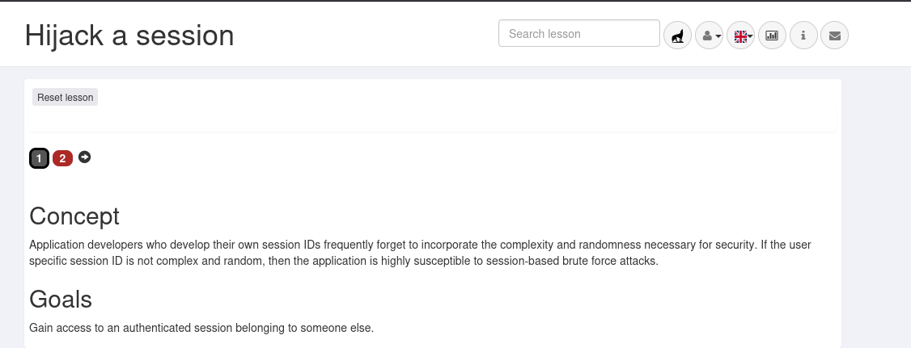
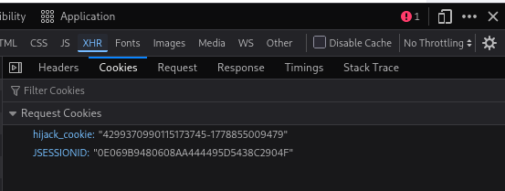

## BROKEN ACCESS CONTROL

Broken Access Control occurs when an application fails to properly enforce restrictions on what authenticated or unauthenticated users are allowed to access or perform. As a result, attackers can bypass authorization mechanisms to view sensitive data, perform unauthorized actions, or escalate privileges within the application.

Access control vulnerabilities are among the most critical web security risks because they directly impact confidentiality, integrity, and authorization boundaries. These flaws often arise when applications trust user-controlled input such as URLs, cookies, identifiers, or session data without performing proper server-side validation.

In this section, several common Broken Access Control vulnerabilities were explored, including:

- **Insecure Direct Object References (IDOR)** – manipulating identifiers to access unauthorized resources.
- **Missing Function Level Access Control** – accessing privileged functionality without proper authorization checks.
- **Cookie Spoofing** – forging predictable authentication cookies to impersonate other users.
- **Session Hijacking** – abusing stolen or weak session tokens to take over authenticated sessions.

Through these labs, the importance of enforcing server-side authorization, validating user permissions, protecting session integrity, and avoiding trust in client-controlled data became evident. Proper access control mechanisms are essential to preventing unauthorized access and maintaining application security.

1. SESSION HIJACKING
## Observation

The `hijack_cookie` values followed a sequential numeric pattern.





These are session cookies from webgoat


This indicates weak session/token generation.

## Security Risk

Attackers may predict future valid session identifiers and hijack authenticated sessions.
## Lesson Learned

Session identifiers should use cryptographically secure randomness and avoid predictable sequences.

2. INSECURE DIRECT OBJECT REFERENCE

This WebGoat lesson demonstrates an **Insecure Direct Object Reference (IDOR)** vulnerability, where an application exposes internal object identifiers without proper authorization checks.

![[Pasted image 20260516151347.png]]


The exercise shows how an authenticated user can manipulate object references such as user IDs to access unauthorized resources or data belonging to other users.

![[Pasted image 20260516153338.png]]

This step demonstrates how attackers inspect raw HTTP responses to identify hidden data that is not visible on the webpage. Using the browser Developer Tools (`F12 → Network`), we analyzed the server response after clicking **View Profile** and discovered additional attributes exposed in the response body. Although the profile page only displayed basic user information, the raw response revealed hidden attributes such as `role` and `userid`, highlighting how sensitive data can still be exposed to authenticated users through insecure application design.

![[Pasted image 20260516153502.png]]

This step demonstrates how predictable RESTful URL patterns can expose direct object references. Although the application initially hid the `userid` attribute from the frontend through client-side filtering, the raw server response revealed the identifier during earlier analysis. By understanding the application’s URL structure, we were able to append the discovered user ID to the profile endpoint and access the profile directly using an alternate route:

```
WebGoat/IDOR/profile/2342384
```

This highlights how attackers can use exposed identifiers and predictable endpoint patterns to bypass intended application behavior and access resources through insecure direct object references (IDOR).

![[Pasted image 20260516160330.png]]

## Navigating RESTful URL Patterns Through IDOR

This exercise demonstrates how predictable RESTful URL structures can be abused to access unauthorized user profiles through an **Insecure Direct Object Reference (IDOR)** vulnerability.

Initially, the application used a profile endpoint tied to the authenticated session. By analyzing the raw HTTP requests and responses in the browser Developer Tools (` → Network → XHR`), we identified a direct object reference pattern within the URL structure:

```
/WebGoat/IDOR/profile/{userId}
```

Using the previously disclosed `userid` value from the server response, we manually modified the endpoint to access another user's profile:

```
/WebGoat/IDOR/profile/2342388
```

The modified request successfully returned another user's profile information (`Buffalo Bill`), confirming that the application failed to properly enforce object-level authorization checks.

![[Pasted image 20260516162748.png]]

![[Pasted image 20260516162825.png]]

This step demonstrates how RESTful applications use different HTTP methods to perform different actions on the same endpoint. Initially, the application used a `GET` request to retrieve profile information. To modify another user’s profile, the request method was manually changed to `PUT` using the browser Developer Tools (`F12 → Network → XHR → Edit and Resend`).

The request `Content-Type` was also changed to:

```
application/json
```

![[Pasted image 20260516172546.png]]

to ensure the server correctly interpreted the payload as JSON data.

A custom JSON body was then crafted and attached to the request to modify Buffalo Bill’s profile attributes:

![[Pasted image 20260516172703.png]]

This demonstrates how attackers can manipulate HTTP methods, object identifiers, and request bodies to exploit insecure object-level authorization (IDOR/BOLA) vulnerabilities in RESTful web applications and APIs.

![[Pasted image 20260516172735.png]]
Successfully modified another user’s profile through a Broken Object Level Authorization (BOLA/IDOR) vulnerability.

3. MISSING FUNCTION LEVEL ACCESS CONTROL

This lab demonstrates how attackers can discover and access hidden application functionality when proper server-side authorization checks are missing. By inspecting the webpage’s HTML structure and hidden menu elements, it was possible to identify restricted features that were not visible in the user interface.

The exercise highlights the difference between simply hiding functionality on the frontend and actually securing it through proper access control mechanisms. It also demonstrates how attackers use browser developer tools and DOM inspection during reconnaissance to uncover sensitive endpoints, administrative functionality, and hidden application features.

![[Pasted image 20260517113816.png]]

Using the browser’s Developer Tools (Inspect Element), the hidden functionality was identified by analyzing the webpage’s HTML structure and navigation components. The investigation focused on the application’s navbar and dropdown menu elements, since hidden administrative functionality is commonly embedded within menus and frontend components.

After expanding the HTML hierarchy inside the Inspector tab, a suspicious element was discovered:

![[Pasted image 20260517114336.png]]

The class name `hidden-menu-item` indicated that the application intentionally contained hidden navigation functionality that was not visible in the normal user interface.
Further inspection of the nested dropdown menu revealed additional hidden submenu entries:

![[Pasted image 20260517114554.png]]

These hidden links exposed restricted functionality related to user administration and configuration management. Although the menu items were hidden from normal users through frontend controls, they were still present within the HTML DOM and accessible through browser inspection tools.

By inspecting the application’s DOM structure using browser Developer Tools, a hidden administrative navigation component was identified:

![[Pasted image 20260517124126.png]]

The menu was hidden through client-side CSS rules using:

![[Pasted image 20260517124314.png]]

After modifying the CSS property to make the element visible, the hidden “Admin” menu appeared within the application interface. This demonstrated how client-side controls can be bypassed through DOM and CSS manipulation, exposing functionality that developers intended to hide from normal users.

![[Pasted image 20260517124449.png]]

The exercise highlights why relying on frontend obscurity is insecure, since attackers can freely modify HTML and CSS rendered within the browser. Proper authorization controls must always be enforced on the server side rather than relying on hidden UI elements.
##### Hidden Administrative Endpoint Enumeration
After exposing the hidden administrative menu through DOM and CSS manipulation, attempts were made to access the concealed functionality. Interacting with the hidden “Users” endpoint triggered backend processing and resulted in an HTTP 415 Unsupported Media Type response.

Using the browser Console and Network tools, the hidden administrative route was identified as:

![[Pasted image 20260517131537.png]]

The response confirmed that the endpoint was active and reachable, while also exposing detailed Spring MVC framework stack traces and backend request-handling behavior. This demonstrated how attackers can leverage hidden frontend functionality, browser developer tools, and backend error messages to enumerate sensitive application routes and gather reconnaissance information about the underlying technology stack and server-side architecture.

## Missing Function Level Access Control – Hidden Admin Endpoint Discovery

In this WebGoat lab, I demonstrated how hidden functionality in a web application can still be accessed through client-side inspection and request manipulation. Using Firefox Developer Tools, I inspected the HTML structure and identified hidden admin menu items that were concealed using CSS classes rather than proper server-side authorization controls.

After revealing the hidden “Admin” dropdown, I discovered internal endpoints such as:

- `/WebGoat/access-control/users-admin-fix`
- `/WebGoat/access-control/config`

Initial interaction with these endpoints using normal browser navigation resulted in HTTP 415 and 404 responses, indicating backend functionality existed but expected different request formats.

![[Pasted image 20260517142102.png]]

To further test the endpoint, I manually modified a legitimate GET request into a crafted POST request using the Network tab’s Edit & Resend functionality. I changed:

- HTTP Method: `GET → POST`
![[Pasted image 20260517142313.png]]

- Added `Content-Type: application/json`
- Included a JSON request body containing a username parameter.

![[Pasted image 20260517142354.png]]

The manipulated request successfully interacted with the backend API and returned JSON user information for “Jerry”, confirming the existence of improperly exposed administrative functionality and demonstrating how hidden client-side controls can be bypassed through direct request manipulation.

Initially the endpoint returned errors until the request header was changed to:

![[Pasted image 20260517220146.png]]
This caused the backend to properly parse the request and return JSON user data.

### Vulnerability Observed

The API exposed sensitive user information without proper authorization checks, including:
- usernames
- admin status
- account hashes
Example exposed object:
![[Pasted image 20260517220259.png]]
## Security Risk 
The application relied on hidden menu items and client-controlled parameters for access control. Although admin functionality was removed from the UI, the backend endpoints remained accessible. By modifying a simple GET request parameter (`?username=Jerry`), it was possible to impersonate an admin user and access sensitive data such as user hashes. This demonstrates Broken Access Control and Missing Function Level Access Control vulnerabilities.
## Lesson Learned 
Security should never depend on hiding functionality in the frontend. Backend systems must always enforce proper authentication and authorization checks server-side. User identity and privilege levels should never be trusted from client-supplied input such as URL parameters. Even after developers attempted to “fix” the issue, the vulnerability remained because the application still trusted client-controlled identity data.

4. SPOOFING AN AUTHENTICATION COOKIE

This lab demonstrated how insecurely generated or predictable authentication cookies can lead to unauthorized access. By analyzing and manipulating the authorization cookie, an attacker may impersonate another user and bypass the application’s access control mechanisms.

The exercise highlighted the risks of weak session management, predictable cookie generation algorithms, and improper authentication validation. Successful exploitation can allow privilege escalation, session hijacking, or unauthorized account access.

![[Pasted image 20260520035308.png]]

After logging in as `admin`, the application generated the following authentication cookie:
![[Pasted image 20260520035417.png]]
The cookie appeared encoded rather than encrypted
# Step 1 - Identify Possible Encoding  
The cookie contained:  
- uppercase letters  
- lowercase letters  
- numbers   
This matched common Base64 characteristics.
# Step 2 - Decode the Cookie  
Using the browser console:

![[Pasted image 20260520035921.png]]

# Step 3 - Analyze the Decoded Value  
The decoded output contained only:  
  
```text  
0-9 and a-f  
```  
  
This strongly indicated hexadecimal encoding.  
  
The value was split into pairs:  
  
```text  
6e 69 6d 64 61  
```  
  
Converting each hexadecimal pair to ASCII produced text: nimda
Reversing the string revealed: admin

# Step 4 - Compare Multiple User Cookies  
Logging in as `webgoat` produced another cookie.  
After Base64 decoding:

![[Pasted image 20260520040657.png]]

The ending section 74616f67626577 in hex decoded to text: taogbew reversing it revealed webgoat

# Step 5 - Identify Cookie Structure  
The decoded cookie format was determined to be:  
  
```text  
[prefix][hex(reverse(username))]  
```  
  
Example:  
  
```text  
65755a74544e65527549 + 6e696d6461  
```  
  
Where:  
- `65755a74544e65527549` = static prefix  
- `6e696d6461` = hex encoded reversed username (`nimda`)  

# Step 6 - Generate a Cookie for Tom  
## Reverse Username  

tom → mot  
## Convert to Hex  

| Character | Hex |     |
| --------- | --- | --- |
| m         | 6d  |     |
| o         | 6f  |     |
| t         | 74  |     |
  Result:  6d6f74  
  
## Append Static Prefix  
  
```text  
65755a74544e65527549 + 6d6f74  
```  
  
Result:  
  
```text  
65755a74544e655275496d6f74  
```  
  
# Step 7 - Encode Back to Base64  
  
Using:  
  
```javascript  
btoa("65755a74544e655275496d6f74")  
```  

![[Pasted image 20260520042154.png]]

The final spoofed cookie was generated.
![[Pasted image 20260520043012.png]]

The `spoof_auth` cookie was modified in:  
  
```text  
DevTools → Storage → Cookies  
```  
  
After refreshing the page, the application authenticated successfully as Tom.

  
# Security Risks  
  
- Authentication bypass  
- User impersonation  
- Session spoofing  
- Privilege escalation  
  
---  
  
# Lessons Learned  
  
- Encoding is not encryption  
- Client-controlled authentication data is dangerous  
- Authentication tokens must be integrity protected  
- Sensitive authentication logic should remain server-side  
  
---  
  
# Mitigation  
  
- Use cryptographically signed session tokens  
- Validate sessions server-side  
- Avoid storing trust decisions in client-controlled cookies  
- Use secure session management frameworks  
- Implement token integrity validation