# Broken Access Control — WebGoat

Broken Access Control occurs when an application fails to enforce restrictions on what authenticated or unauthenticated users may access or perform. Attackers can bypass authorization to view sensitive data, perform unauthorized actions, or escalate privileges.

Access control flaws are among the most critical web risks because they directly impact confidentiality, integrity, and authorization boundaries. They often arise when applications trust user-controlled input—URLs, cookies, identifiers, or session data—without server-side validation.

This module covers:

- **Insecure Direct Object References (IDOR)** — manipulating identifiers to access unauthorized resources
- **Missing Function Level Access Control** — reaching privileged functionality without authorization checks
- **Cookie spoofing** — forging predictable authentication cookies to impersonate users
- **Session hijacking** — abusing weak or predictable session tokens

---

## 1. Session hijacking

### Observation

The `hijack_cookie` values followed a sequential numeric pattern.


This indicates weak session or token generation.

### Security risk

Attackers may predict future valid session identifiers and hijack authenticated sessions.

### Lesson learned

Session identifiers should use cryptographically secure randomness and avoid predictable sequences.

---

## 2. Insecure Direct Object Reference (IDOR)

This lesson demonstrates **IDOR**: the application exposes internal object identifiers without proper authorization checks.

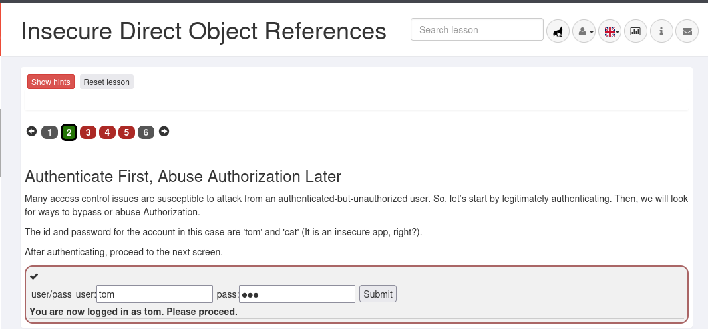

An authenticated user can manipulate object references such as user IDs to access unauthorized resources or data belonging to other users.

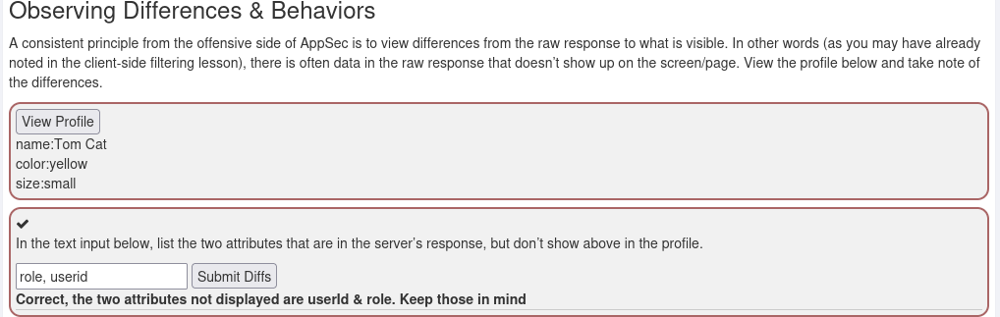

Using browser Developer Tools (**F12 → Network**), the server response after **View Profile** revealed attributes not displayed in the UI—such as `role` and `userid`—showing how sensitive data can leak through insecure design even when the frontend hides fields.

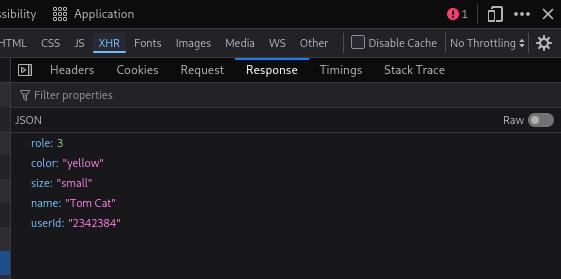

### Predictable RESTful URL patterns

Although the application hid `userid` on the frontend, the raw response had already disclosed it. By appending the discovered ID to the profile endpoint, the profile was reachable through an alternate route:

```
WebGoat/IDOR/profile/2342384
```

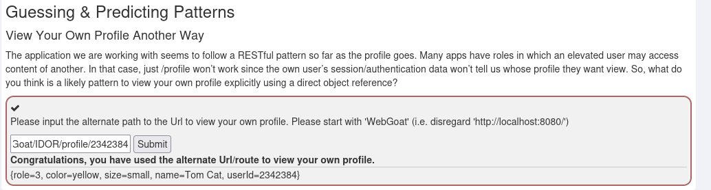

### Navigating RESTful URL patterns through IDOR

Analysis in **Network → XHR** revealed a direct object reference pattern:

```
/WebGoat/IDOR/profile/{userId}
```

Using the disclosed `userid`, the endpoint was changed to access another user's profile:

```
/WebGoat/IDOR/profile/2342388
```

The response returned **Buffalo Bill**'s profile, confirming missing object-level authorization.

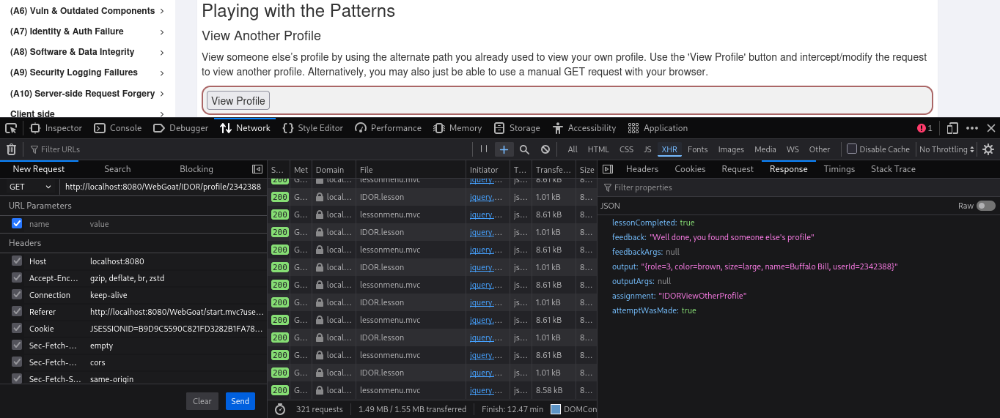

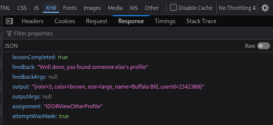

### Modifying another user's profile (BOLA)

The application used `GET` to retrieve profiles. To modify another user's data, the method was changed to `PUT` via **F12 → Network → XHR → Edit and Resend**, with:

```
Content-Type: application/json
```

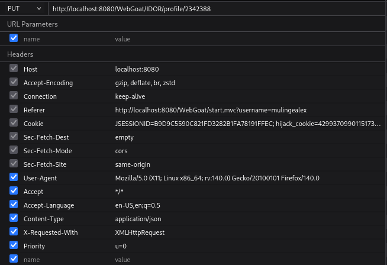

A JSON body was crafted to modify Buffalo Bill's attributes:

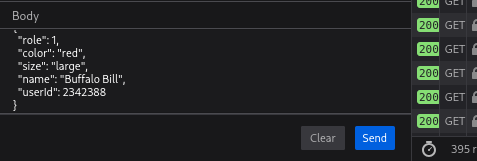

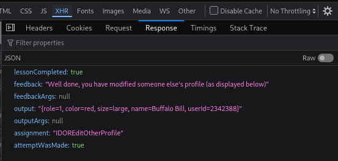

This demonstrates how attackers manipulate HTTP methods, object identifiers, and request bodies to exploit insecure object-level authorization (IDOR/BOLA) in REST APIs.

---

## 3. Missing function level access control

This lab shows how attackers discover hidden functionality when server-side authorization is absent. Inspecting HTML and hidden menu elements exposed restricted features not visible in the UI—illustrating the difference between hiding UI elements and enforcing access control on the server.

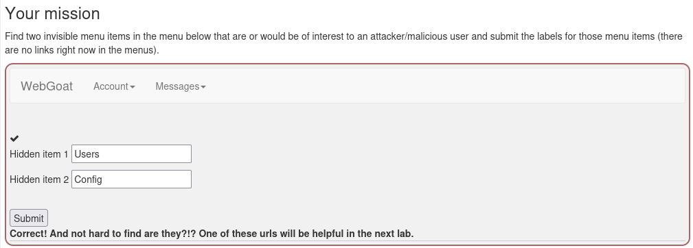

### DOM inspection

In the Inspector tab, a suspicious element appeared:

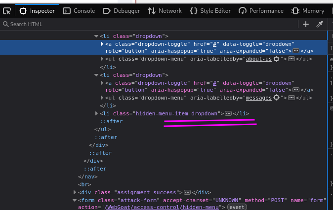

The class `hidden-menu-item` indicated navigation intentionally hidden from normal users. Nested dropdown entries exposed admin-related links:

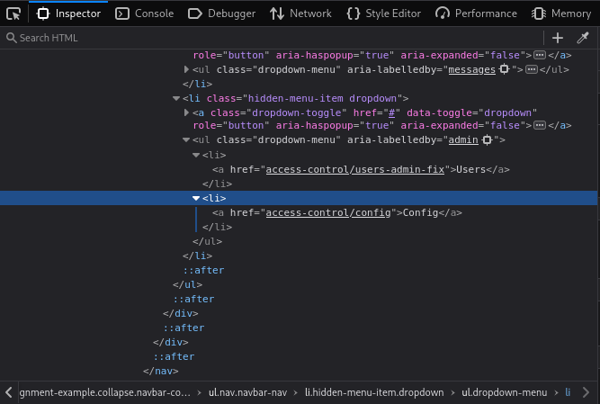

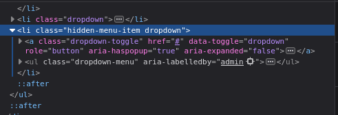

The menu was concealed with client-side CSS:

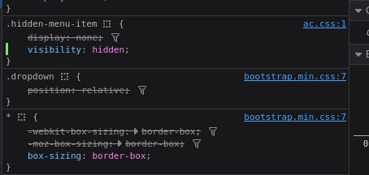

After changing the CSS to make the element visible, the **Admin** menu appeared—showing that frontend obscurity is bypassable through DOM and CSS manipulation.

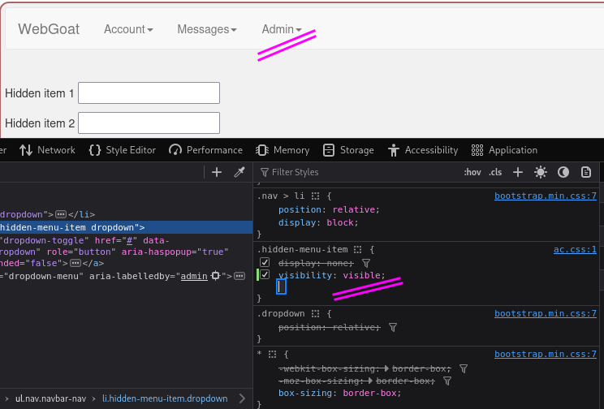

Authorization must be enforced server-side, not through hidden UI alone.

### Hidden administrative endpoint enumeration

Interacting with the hidden **Users** endpoint returned **HTTP 415 Unsupported Media Type**. Console and Network tools identified the route:

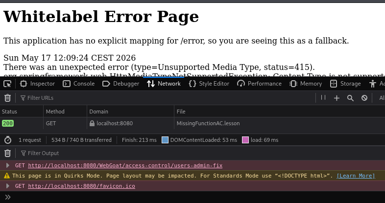

The response confirmed the endpoint was reachable and leaked Spring MVC stack traces—useful for technology and route enumeration.

### Hidden admin endpoint discovery

Using Firefox Developer Tools, hidden admin items were found under CSS concealment rather than server-side denial. Discovered routes included:

- `/WebGoat/access-control/users-admin-fix`
- `/WebGoat/access-control/config`

Normal navigation returned **415** and **404**, indicating backends that expected different request formats.

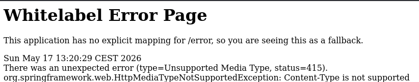

A legitimate `GET` was edited to a crafted `POST` via **Edit & Resend**:

- **Method:** `GET` → `POST`

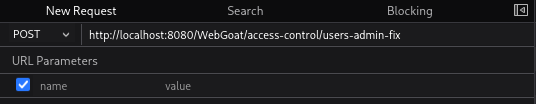

- **Header:** `Content-Type: application/json`
- **Body:** JSON with a username parameter

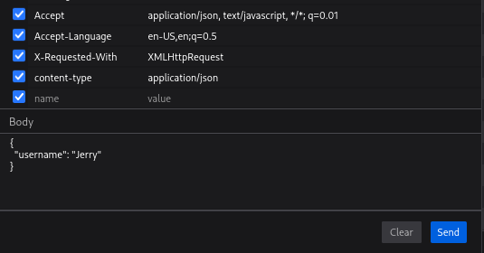

The backend returned JSON for **Jerry**, confirming improperly exposed administrative functionality bypassable through direct request manipulation.

Setting the correct `Content-Type` on a `GET` to `/WebGoat/access-control/users` allowed the server to parse the request and return user data:

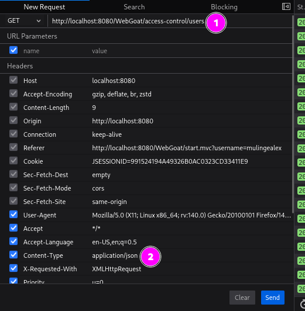

### Vulnerability observed

The API exposed sensitive data without authorization checks, including usernames, admin status, and account hashes.

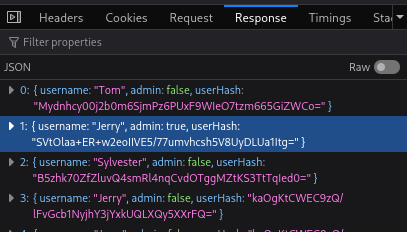

### Security risk

The application relied on hidden menus and client-controlled parameters. Admin UI was removed, but endpoints remained reachable. Changing `?username=Jerry` allowed impersonation and access to hashes—**Broken Access Control** and **Missing Function Level Access Control**.

### Lesson learned

Never depend on hiding functionality in the frontend. Enforce authentication and authorization server-side; do not trust client-supplied identity in URL parameters or request bodies.

---

## 4. Spoofing an authentication cookie

This lab shows how predictable or weakly generated authentication cookies enable unauthorized access. Analyzing and forging the cookie can impersonate users and bypass access control—highlighting risks of weak session management and improper validation.

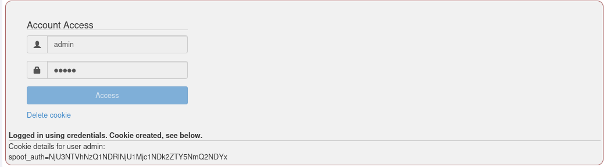

After logging in as `admin`, the application set:

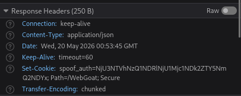

The cookie appeared **encoded**, not encrypted.

### Step 1 — Identify possible encoding

The cookie contained uppercase letters, lowercase letters, and numbers—consistent with Base64.

### Step 2 — Decode the cookie

Using the browser console:

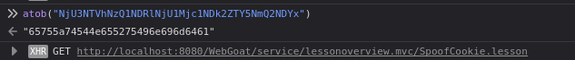

### Step 3 — Analyze the decoded value

The decoded output contained only `0-9` and `a-f`, indicating hexadecimal encoding. Pairs such as `6e 69 6d 64 61` decode to ASCII **nimda**; reversed → **admin**.

### Step 4 — Compare multiple user cookies

Logging in as `webgoat` and decoding:

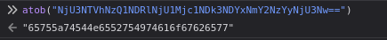

The suffix `74616f67626577` in hex is **taogbew**; reversed → **webgoat**.

### Step 5 — Identify cookie structure

```
[prefix][hex(reverse(username))]
```

Example:

```text
65755a74544e65527549 + 6e696d6461
```

- `65755a74544e65527549` — static prefix
- `6e696d6461` — hex-encoded reversed username (`nimda`)

### Step 6 — Generate a cookie for Tom

| Step | Value |
| ---- | ----- |
| Reverse username | `tom` → `mot` |
| Hex encode | `m`→`6d`, `o`→`6f`, `t`→`74` → `6d6f74` |
| Append prefix | `65755a74544e65527549` + `6d6f74` → `65755a74544e655275496d6f74` |

### Step 7 — Encode back to Base64

```javascript
btoa("65755a74544e655275496d6f74")
```

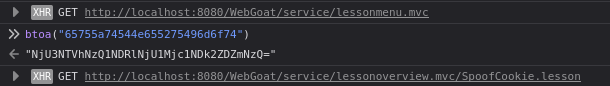

The spoofed cookie was placed under **DevTools → Storage → Cookies**. After refresh, the application authenticated as **Tom**.

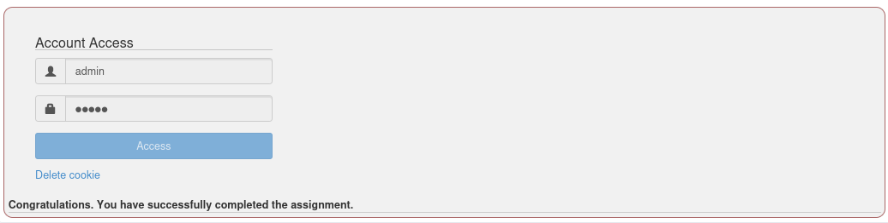

### Security risks

- Authentication bypass
- User impersonation
- Session spoofing
- Privilege escalation

### Lessons learned

- Encoding is not encryption
- Client-controlled authentication data is dangerous
- Tokens must be integrity-protected
- Sensitive auth logic belongs server-side

### Mitigation

- Use cryptographically signed session tokens
- Validate sessions server-side
- Do not base trust decisions on client-controlled cookies
- Use established session management frameworks
- Implement token integrity validation
