# Cross-Site Scripting (XSS) — WebGoat

Cross-Site Scripting (XSS) is a web application vulnerability that occurs when untrusted user input is rendered by the browser without proper sanitization or output encoding. This allows attacker-controlled JavaScript to execute within the context of a trusted web application.

A basic proof-of-concept payload:

```
<script>alert(1)</script>
```

If reflected or rendered unsafely by the application, the browser interprets the payload as executable JavaScript instead of plain text.

This write-up documents three XSS variants completed in the WebGoat **CrossSiteScripting** lesson: **Reflected XSS**, **Stored XSS**, and **DOM-Based XSS**. Each section follows the same structure—reconnaissance, exploitation, verification, and impact analysis.

---

## Overview

WebGoat's Cross-Site Scripting module demonstrates how insufficient input validation and output encoding enable client-side code execution across different attack surfaces:

| XSS Type | Where the payload lives | Primary attack vector |
| -------- | ----------------------- | --------------------- |
| **Reflected** | Server response (immediate reflection) | Crafted request parameters |
| **Stored** | Server-side persistence (database) | User-submitted content rendered to others |
| **DOM-Based** | Client-side JavaScript processing | URL fragments and client-side routes |

All three labs confirmed successful JavaScript execution in the browser, validating both classic injection techniques and real-world DOM XSS nuances such as `innerHTML` sink behavior.

---

## Objectives

- Identify user-controlled input that reaches the browser without adequate encoding
- Craft and deliver XSS payloads that execute arbitrary JavaScript in the application context
- Use Burp Suite and browser Developer Tools to intercept, manipulate, and verify exploitation
- Distinguish between server-reflected, stored, and DOM-based XSS attack paths
- Document root causes, security impact, and practical mitigation strategies

---

## Reflected XSS

Reflected XSS occurs when user input is immediately reflected by the server and executed as JavaScript in the victim's browser. This lab targeted the WebGoat **CrossSiteScripting** lesson to find a parameter that echoed unsanitized input back into the response.

### Reconnaissance

The vulnerable page contained:

- Shopping cart items
- Credit card input field
- Access code input field
- Quantity parameters

The application hinted that `alert()` and `console.log()` could be used to identify XSS vulnerabilities.

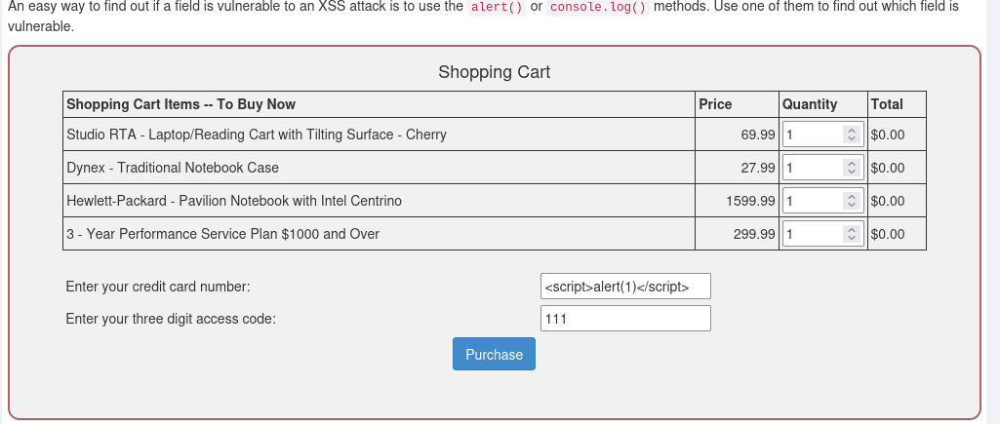

### Payload Used

```
<script>alert(1)</script>
```

### Exploitation Steps

1. Injected the payload into the vulnerable parameter and submitted the request.
2. Intercepted the request in **Burp Suite** and confirmed the payload was present in the outgoing request.

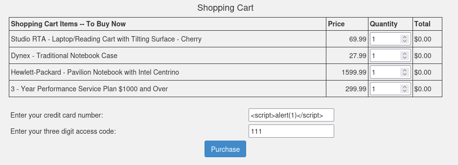

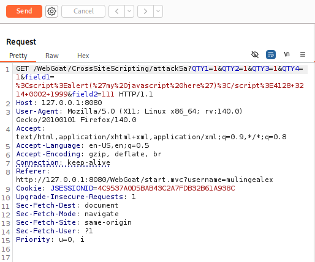

3. Forwarded the captured request to **Burp Repeater** for controlled, repeatable testing.

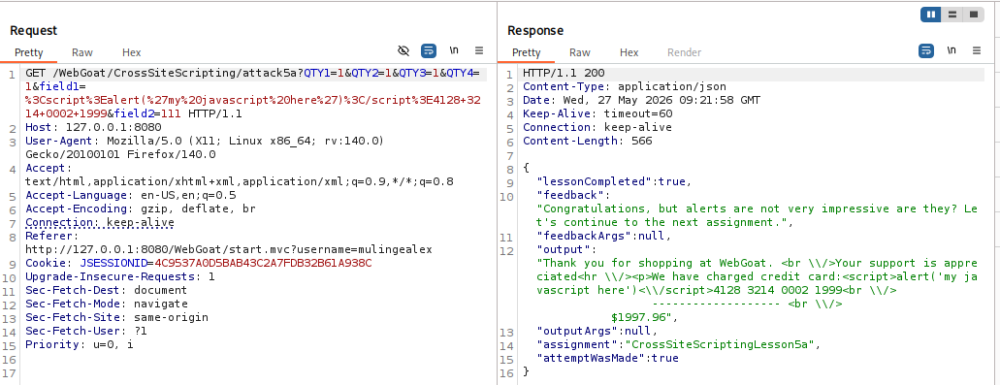

4. Verified that the server reflected the payload and the browser executed it, displaying `alert(1)`.

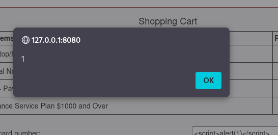

### Findings

- User-controlled input was accepted and reflected directly into the server response.
- No output encoding or sanitization was applied before rendering.
- The frontend used unsafe HTML rendering logic, allowing the browser to interpret injected markup as executable script.
- Burp Repeater confirmed consistent payload reflection across repeated requests.

### Security Impact

Reflected XSS enables attackers to craft malicious links or forms that execute JavaScript when a victim interacts with them. In a real-world scenario, this can lead to session cookie theft, credential harvesting, phishing overlays, keylogging, or unauthorized actions performed on behalf of the victim—all within the trusted origin of the application.

---

## Stored XSS

Stored XSS occurs when malicious JavaScript is saved on the server—typically in a database, comment section, message board, or profile field—and later rendered to other users without sanitization.

### Lab Scenario

The application contained a comment feature that allowed users to submit and view messages. Because submitted comments were stored and displayed to all visitors, the feature presented a clear attack surface for Stored XSS.

The challenge required posting a comment that would execute the following JavaScript function:

```
webgoat.customjs.phoneHome()
```

Successful execution would generate a unique response value used to complete the lesson.

### Reconnaissance

Before attempting exploitation, the comment field was identified as the primary input vector. Existing comments were displayed to users, confirming that user-supplied content was rendered within the page.

### Payload Used

```
<script>webgoat.customjs.phoneHome()</script>
```

### Exploitation Steps

1. Submitted the payload through the comment form.
2. Confirmed the application accepted and stored the input.

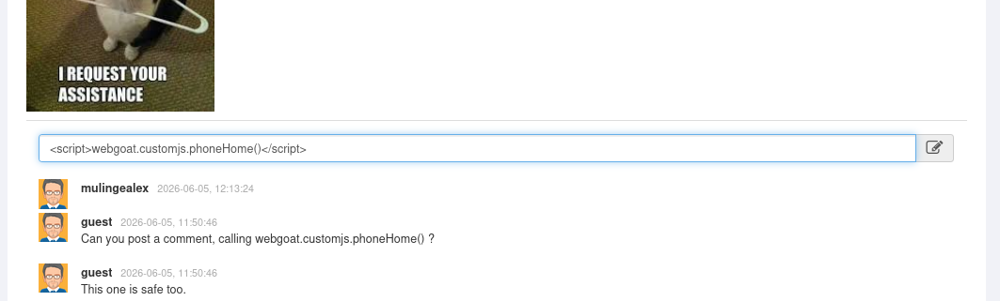

3. Reloaded the page so the stored content was rendered and the embedded JavaScript executed automatically.

4. Opened browser Developer Tools to inspect network requests and responses.

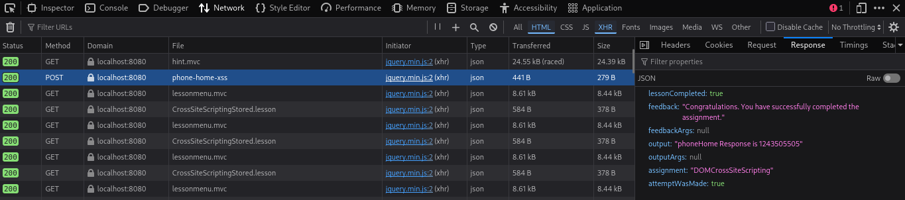

### Findings

- The application stored raw HTML/JavaScript in the comment field without server-side sanitization.
- Stored content was rendered unsafely on subsequent page loads, triggering automatic script execution for every visitor.
- Network analysis confirmed successful invocation:

```
phoneHome Response is 1243505505
```

### Attack Flow

1. Attacker submits malicious JavaScript through the comment form.
2. Application stores the payload in a database.
3. Victim visits the affected page.
4. Browser renders and executes the stored script.
5. Attacker achieves their intended objective—such as session theft, account takeover, or data exfiltration.

### Security Impact

Stored XSS is among the most dangerous XSS variants because a single injection can compromise every user who views the affected page—without requiring them to click a crafted link. Persistent payloads in comment sections, profiles, or admin dashboards can enable long-term compromise, worm-like propagation, and large-scale credential or session harvesting.

---

## DOM-Based XSS

DOM-Based XSS occurs when client-side JavaScript processes attacker-controlled input and writes it into the DOM through a dangerous sink—without the payload ever being reflected by the server. The vulnerability exists entirely in the browser.

Unlike traditional reflected XSS, the malicious payload in this lab never needed to reach the server. Attacker-controlled data in the URL fragment was processed by client-side routing logic and rendered unsafely.

### Reconnaissance

The lesson hinted that the vulnerability could be discovered by inspecting client-side route configurations.

Using Firefox Developer Tools (**F12**) and the Debugger search functionality (**Ctrl + Shift + F**), the JavaScript source was searched for route definitions using the keyword:

```
route
```

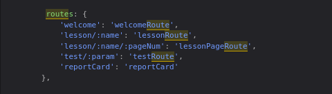

### Findings

A hidden Backbone.js route was identified:

```
'test/:param': 'testRoute'
```

This indicated that any URL matching the pattern below would invoke the `testRoute()` function:

```
#test/<value>
```

The vulnerable route format became:

```
start.mvc#test/
```

which allowed arbitrary attacker-controlled payloads to be appended to the URL fragment.

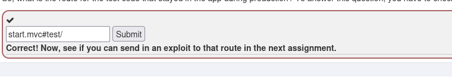

DOM XSS attack path:

```
Attacker-controlled input → Client-side JavaScript → Dangerous DOM sink
```

### Payload Used

**Initial attempt (failed):**

```
<script>webgoat.customjs.phoneHome()</script>
```

Full URL:

```
http://127.0.0.1:8080/WebGoat/start.mvc#test/<script>webgoat.customjs.phoneHome()</script>
```

**Successful payload:**

```

```

Full exploit URL:

```
http://127.0.0.1:8080/WebGoat/start.mvc#test/
```

Modern browsers often do not execute dynamically injected `<script>` tags when inserted through DOM manipulation methods such as `innerHTML`. An event-handler-based payload bypassed this restriction—a common real-world DOM XSS nuance.

### Exploitation Steps

1. Discovered the hidden Backbone route `test/:param` through source code analysis.
2. Crafted a URL targeting `start.mvc#test/` with an appended payload in the fragment.
3. Tested a `<script>` tag payload; confirmed it did not execute due to `innerHTML` sink behavior.
4. Switched to an `` tag with an `onerror` event handler to trigger `webgoat.customjs.phoneHome()`.
5. Loaded the crafted URL and verified execution in the browser console.

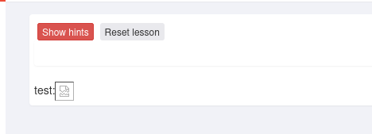

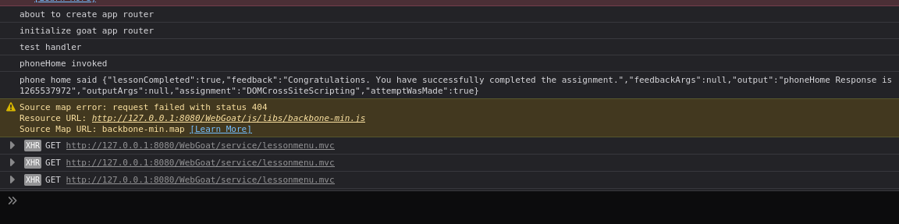

### Verification

The browser console displayed:

```
phoneHome invoked
```

and returned a success response containing a random number:

```
phoneHome Response is 1265537972
```

This confirmed successful DOM-based XSS exploitation.

### Security Impact

DOM-Based XSS is difficult to detect with traditional server-side scanning because the malicious payload may never appear in HTTP request bodies or server logs—it lives in the URL fragment processed only by client-side code. Attackers can exploit client-side routing, hash-based navigation, and unsafe DOM sinks to execute JavaScript, bypassing server-side filters entirely.

---

## Key Takeaways

- **Context matters.** The same `<script>` payload succeeded in Reflected and Stored XSS but failed in DOM XSS due to `innerHTML` rendering behavior. Effective testing requires understanding how and where input is processed.
- **Not all XSS is server-visible.** DOM-Based XSS demonstrates that client-side JavaScript can introduce vulnerabilities independent of server-side reflection or storage.
- **Stored XSS scales impact.** A single stored payload can affect every user who views the page, making it more dangerous than one-off reflected attacks.
- **Tooling accelerates validation.** Burp Suite (Reflected XSS) and browser Developer Tools (DOM and Stored XSS) were essential for intercepting requests, tracing client-side logic, and confirming execution.
- **Output encoding is non-negotiable.** All three variants stemmed from the same root cause: user input was treated as HTML or script instead of inert text.

---

## Mitigation Strategies

| Control | Applies to | Implementation |
| ------- | ---------- | -------------- |
| **Output encoding** | Reflected, Stored | Encode user input for the correct context (HTML, attribute, JavaScript, URL) before rendering. Use framework-provided encoders. |
| **Input validation** | All types | Enforce allowlists for expected input formats. Reject or strip dangerous characters and tags where appropriate. |
| **Content Security Policy (CSP)** | All types | Restrict script sources with a strict CSP (e.g., `script-src 'self'`). Use nonces or hashes for inline scripts. |
| **Safe DOM APIs** | DOM-Based | Avoid `innerHTML`, `document.write`, and `eval`. Prefer `textContent`, `setAttribute`, and framework-safe binding methods. |
| **Sanitization libraries** | Stored | Use mature HTML sanitizers (e.g., DOMPurify) when rich HTML input is required. |
| **HttpOnly cookies** | All types | Mark session cookies `HttpOnly` so stolen cookies via XSS cannot be read by injected scripts. |
| **Security testing** | All types | Include XSS in manual and automated testing—cover URL fragments, stored fields, and client-side routes, not just form parameters. |

---

## Conclusion

The WebGoat Cross-Site Scripting labs demonstrated three distinct paths to client-side code execution: immediate server reflection, persistent storage, and client-side DOM manipulation. Each variant required different reconnaissance techniques and payloads, reinforcing that XSS is not a single vulnerability class but a family of flaws rooted in unsafe handling of user-controlled data.

From a defensive standpoint, the most effective approach combines context-aware output encoding, strict Content Security Policy, safe client-side rendering practices, and thorough testing across both server-side and client-side attack surfaces. Understanding how each XSS type propagates—and which payloads succeed in which contexts—is essential for both offensive security assessment and building resilient web applications.
