# SQL Injection (Intro) — WebGoat

A SQL injection attack consists of insertion or "injection" of malicious code via the SQL query input from the client to the application.

SQL injections can occur when unfiltered data from the client—such as input from a search field—reaches the SQL interpreter of the application. If an application fails to sanitize user input (using prepared statements or similar) or filter special characters, attackers can manipulate the underlying SQL statement to their advantage.

Throughout the SQL Injection project, the `employees` table becomes the target used to understand how applications interact with databases and how attackers manipulate SQL queries.

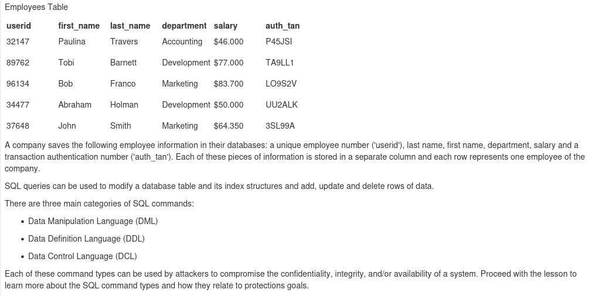

Initially, normal SQL queries retrieve legitimate data—for example, finding Bob Franco's department. As the lessons progress, the same table demonstrates how insecure input handling allows attackers to alter query logic, bypass filters, extract sensitive information, modify records, or access unauthorized data.

## Query flow

```
User Input → Application Query → Employees Table → Database Response
```

**Secure applications:** user input is treated only as data.

**Vulnerable applications:** user input can become executable SQL commands.

This table is used to:

- Practice normal SQL queries
- Understand how databases process requests
- Test SQL injection payloads
- Observe how injected conditions affect returned results
- Analyze impact on confidentiality, integrity, and availability (CIA triad)

As the project advances, exercises move from simple data retrieval to authentication bypass, query manipulation, UNION injections, and more advanced SQLi techniques using the same database interaction model.

---

## SQL Injection Intro — Department lookup

Executed a structured SQL query within the WebGoat SQL Injection Intro module to retrieve employee department information from the `employees` table.

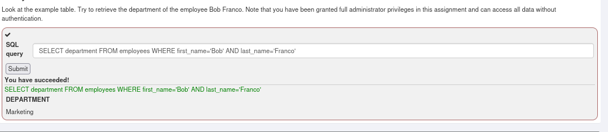

This demonstrated how SQL queries interact with relational databases using `SELECT`, `FROM`, and `WHERE` clauses to filter and return specific records. The lab builds foundational understanding of database operations, query logic, and how improper input handling can lead to SQL injection vulnerabilities.

---

## SQL command categories

This section introduces the three primary categories of SQL commands used in database management and commonly referenced in SQL injection security testing:

| Category | Purpose | Common commands |
| -------- | ------- | ---------------- |
| **Data Manipulation Language (DML)** | Retrieve and modify data in tables | `SELECT`, `INSERT`, `UPDATE`, `DELETE` |
| **Data Definition Language (DDL)** | Define or alter database structures | `CREATE`, `ALTER`, `DROP` |
| **Data Control Language (DCL)** | Manage permissions and access control | `GRANT`, `REVOKE` |

Understanding these categories is essential for recognizing how SQL injection attacks manipulate database operations and impact the CIA triad.

### 1. Data Manipulation Language (DML)

DML commands interact with and manage data stored within relational databases, including `SELECT`, `INSERT`, `UPDATE`, and `DELETE`.

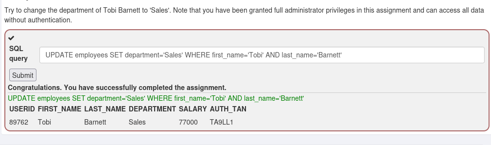

Completed a DML exercise using an `UPDATE` statement to modify employee department information in the `employees` table. The lab showed how `UPDATE`, `SET`, and `WHERE` clauses alter existing records—and how insecure query handling could let attackers manipulate data and compromise integrity through SQL injection.

### 2. Data Definition Language (DDL)

DDL commands define database structures (schema): tables, indexes, views, relationships, triggers, and more.

If an attacker injects DDL commands, they can violate **integrity** (`ALTER`, `DROP`) and **availability** (`DROP`).

- **CREATE** — create database objects such as tables and views
- **ALTER** — modify the structure of existing objects
- **DROP** — delete objects from the database

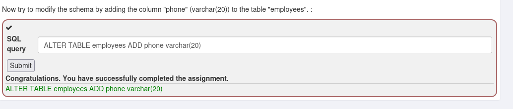

Completed the DDL module by practicing `CREATE`, `ALTER`, and `DROP`, including adding a new column to `employees` with `ALTER TABLE`. The exercise showed how mishandled DDL in vulnerable applications lets attackers manipulate or destroy structures, impacting integrity and availability.

### 3. Data Control Language (DCL)

DCL implements access control on database objects. Injected DCL can violate **confidentiality** (`GRANT`) and **availability** (`REVOKE`)—for example, granting admin privileges or revoking the real administrator's access.

- **GRANT** — give a user privileges on database objects
- **REVOKE** — withdraw privileges previously granted

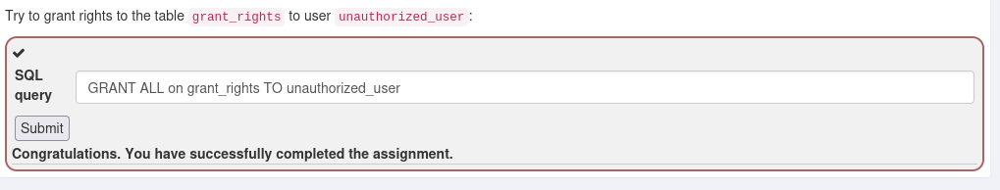

Completed the DCL module exploring permission management with `GRANT` and `REVOKE`.

---

## SQL injection and the CIA triad

SQL injection directly impacts the CIA triad by letting attackers manipulate insecure database queries:

| Pillar | Impact | Example |
| ------ | ------ | ------- |
| **Confidentiality** | Unauthorized data disclosure | Injected `SELECT` returning credentials or PII |
| **Integrity** | Unauthorized modification or deletion | Malicious `UPDATE` or `DELETE` |
| **Availability** | Service disruption or data destruction | `DROP TABLE` causing application failure |

---

## Numeric SQL injection

Numeric SQL injection targets applications that concatenate unsanitized numeric input into queries. Unlike string-based SQLi, numeric injection often does not require quotation marks because values are inserted directly into the query structure.

When user-controlled numeric parameters are concatenated without validation, attackers can alter logic with conditions such as `OR 1=1`, exposing records and bypassing filters.

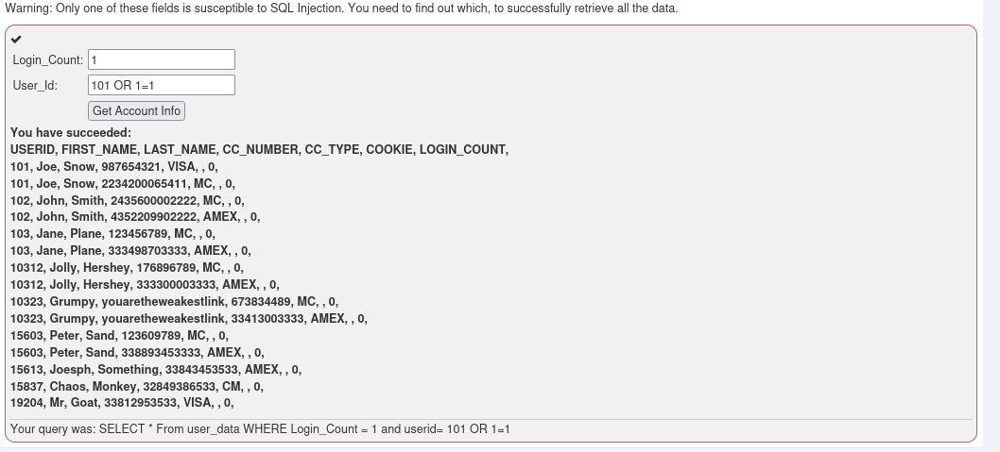

---

## String SQL injection — Compromising confidentiality

This lab demonstrates string-based SQL injection in an internal employee management system. Employees supply last name and authentication TAN (Transaction Authentication Number) to retrieve department and salary information.

**Objective:** Exploit insecure query construction to bypass authentication and retrieve confidential records from `employees` without valid credentials for other users.

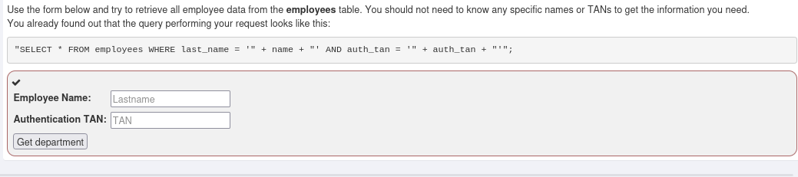

### Vulnerable query structure

The application dynamically constructed:

```sql
SELECT * FROM employees
WHERE last_name = '" + name + "'
AND auth_tan = '" + auth_tan + "'";
```

Because input was concatenated without sanitization or parameterized queries, the application was vulnerable to SQL injection.

### Injection payload

Injected into the Authentication TAN field:

```sql
3SL99A' OR '1'='1
```

Resulting query:

```sql
SELECT * FROM employees
WHERE last_name='Smith'
AND auth_tan='3SL99A' OR '1'='1';
```

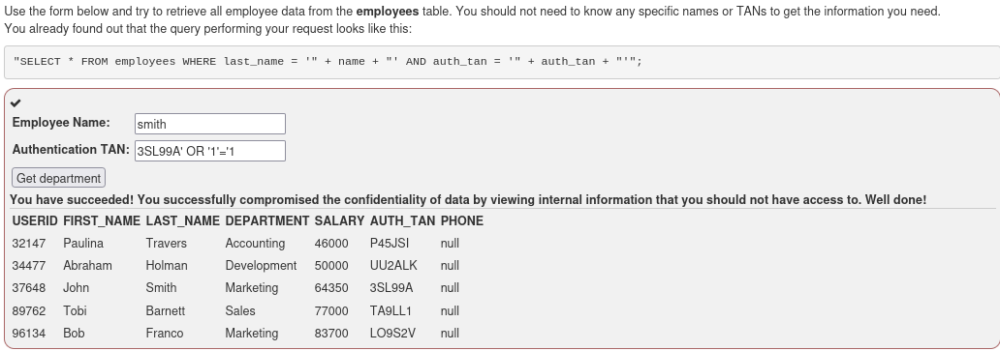

### Exploitation analysis

The condition `OR '1'='1'` always evaluates to true, causing the database to return all rows instead of a single authenticated user. The attack bypassed authorization and exposed sensitive internal employee information.

---

## Query chaining — Compromising integrity

This lab shows how SQL injection can compromise integrity through **stacked queries**. Unsanitized input allowed additional commands to be appended and executed in the same request.

**Objective:** Manipulate salary records by injecting an unauthorized `UPDATE` into the backend query.

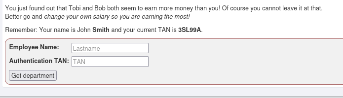

### Vulnerable query concept

The application accepted employee name and authentication TAN and concatenated values without parameterized statements, enabling stacked execution via the semicolon (`;`) metacharacter.

### Injection payload

```
Smith'; UPDATE employees SET salary=999999 WHERE last_name='Smith
```

Authentication TAN:

```
3SL99A
```

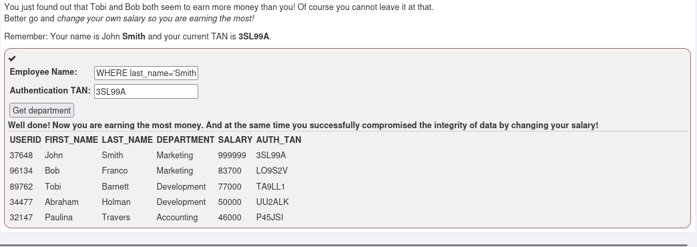

### Exploitation result

The injected `UPDATE` modified John Smith's salary in `employees`, making the attacker-controlled account the highest-paid employee. The attack moved beyond disclosure to direct record manipulation through chained statements.

---

## Destructive SQL — Compromising availability

This lab demonstrates compromising **availability** through destructive query chaining. Unsanitized input in a search field allowed stacked statements against backend operations.

**Objective:** Delete the `access_log` table storing employee activity records.

### Vulnerable query concept

User input was likely incorporated into a query similar to:

```sql
SELECT * FROM access_log
WHERE action LIKE '%INPUT%';
```

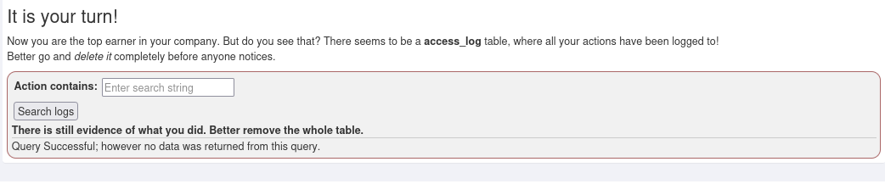

Without parameterized queries or sanitization, the application was vulnerable to stacked-query SQL injection.

### Injection payload

```sql
'; DROP TABLE access_log;--
```

### Payload breakdown

| Component | Purpose |
| --------- | ------- |
| `'` | Closes the original SQL string |
| `;` | Terminates the original statement |
| `DROP TABLE access_log` | Executes a destructive query |
| `--` | Comments out remaining syntax |

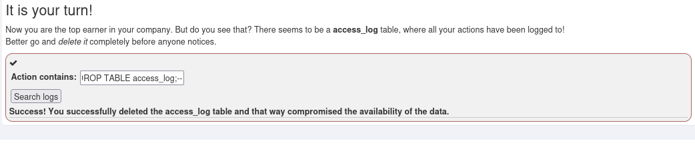

### Exploitation result

The injected query deleted `access_log` from the database:

- Activity logs became inaccessible
- Logging functionality was disrupted
- Database resources were unavailable to legitimate users and administrators

This showed how SQL injection can escalate from disclosure to destructive operations.

---

## Conclusion

The SQL Injection Intro module demonstrated how insecure handling of user-controlled input lets attackers manipulate backend SQL queries and compromise database security. Exercises covered DML, DDL, and DCL fundamentals while showing impact on the CIA triad through string-based and numeric injection, authentication bypass, query chaining, and destructive operations such as unauthorized updates and table deletion.

These scenarios highlight why applications must use parameterized queries, prepared statements, input validation, least-privilege access control, and secure query construction to mitigate SQL injection in modern applications.
